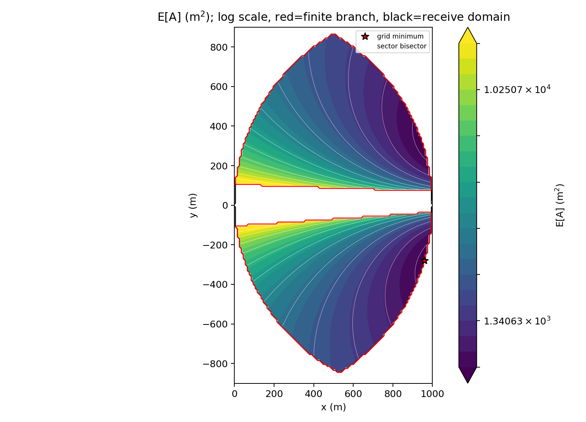
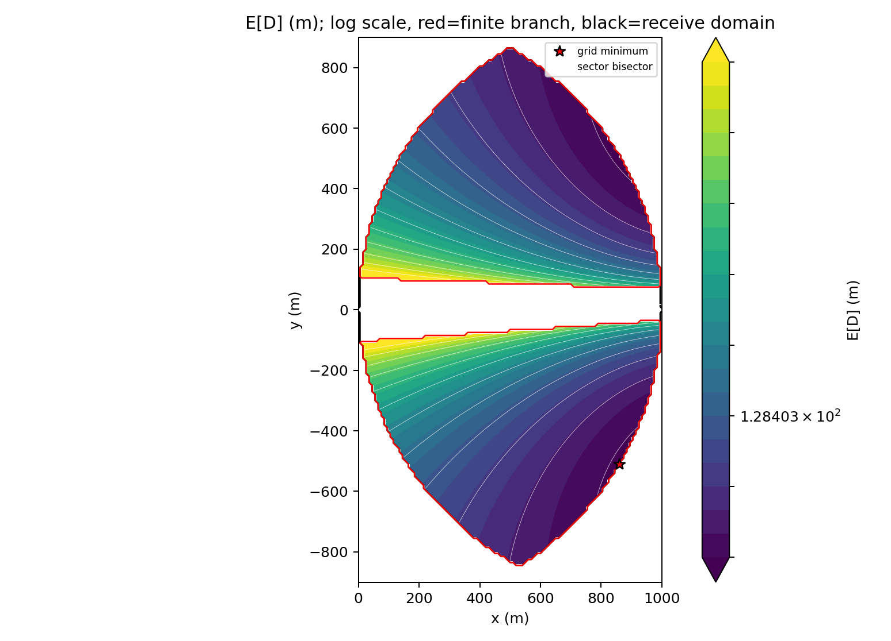

# 问题二：第二检测点的候选区域与定位效果

本节作为总论文中的问题二部分，讨论第二检测点放在哪里、如何量化一次交会结果，以及如何对未知干扰源和测向误差取总体期望。面积和直径分别计算，最后比较两种指标的含义。

## 1. 候选区域

将第一次检测点平移到原点，记为

$$
S_1=(0,0).
$$

第一次测得的扇形全角为

$$
\beta=2^\circ,
\qquad \varepsilon=1^\circ=\frac{\beta}{2},
\qquad k=\tan\beta.
$$

旋转坐标轴后，第一次扇形写成

$$
W_1=\{(X,Y):Y\geq0,\ kX-Y\geq0\}.
$$

按当前布点模型，先采用 $1000\,\mathrm{m}$ 的基础有效接收半径。对第一扇形外圆弧上距离为 $1000\,\mathrm{m}$ 的两个关键端点，取

$$
P_0=(1000,0),
\qquad
P_\beta=(1000\cos\beta,1000\sin\beta).
$$

由这两个端点和 $S_1$ 产生的保守第二检测点候选区域为三个圆盘的交集

$$
\boxed{
\mathcal F_{\mathrm{recv}}
=D((0,0),1000)\cap D(P_0,1000)\cap D(P_\beta,1000).
}
$$

直角坐标约束为

$$
x^2+y^2\leq1000^2,
$$

$$
(x-1000)^2+y^2\leq1000^2,
$$

$$
(x-1000\cos\beta)^2+(y-1000\sin\beta)^2\leq1000^2.
$$

将 $S_2$ 写成极坐标

$$
S_2=(\rho\cos\vartheta,\rho\sin\vartheta),
$$

则上述约束等价于

$$
0\leq\rho\leq1000,
\qquad
\rho\leq2000\cos\vartheta,
\qquad
\rho\leq2000\cos(\vartheta-\beta),
$$

并需保留原始圆盘不等式检查余弦符号。若额外要求第二检测点位于第一扇形前方，则取 $0\leq\vartheta\leq\beta$。

这个区域只表达“能否接收到信号”的硬约束，并不保证两扇形的交集一定有界，也不保证面积或直径期望最小。后文取 $R=1500\,\mathrm{m}$ 描述源点先验范围；如果题目要求第二点必须覆盖整个 $R=1500\,\mathrm{m}$ 源域，应根据实际通信半径重新构造接收约束，不能把 $1000\,\mathrm{m}$ 无条件当成所有距离的信号上限。若采用其他有效距离，只需将圆盘半径替换为相应数值。

## 2. 直觉观察：交会角越大通常越有利

设两条测向中心线的夹角为 $\gamma$。两条近似相交直线的交点对边界扰动的放大因子通常含有

$$
\frac{1}{|\sin\gamma|}.
$$

当 $\gamma$ 接近 $0$ 或 $180^\circ$ 时，两条方向线近似平行，极小的角度误差会导致很远的交点，交集容易变成长条；当 $\gamma$ 较大时，误差带通常更快收缩。因此，直观的布点策略是尽量使第二次测向方向与第一次测向方向形成较大的交会角。

这个判断只能作为选点的先验，不足以直接代替目标函数：

- 干扰源位置未知，$\gamma$ 随源点位置变化；
- 测向误差会使第二扇形在一个角度区间内旋转；
- 同一交会角下，第二检测点到源点的距离不同，交集尺度也不同；
- 第二扇形可能靠近 $S_1$、扇形端点或边界，交集拓扑会由四边形变为三角形、线段或无界集。

所以“最大化交会角”适合作为定性解释或初始搜索方向；正式比较应计算面积期望和直径期望。

## 3. 单次源点和误差下的交集

### 3.1 源点和第二扇形

将干扰源写成

$$
G=(a,b)=(s\cos\psi,s\sin\psi),
$$

其中 $s$ 为源点到 $S_1$ 的距离，$\psi$ 为源点极角。给定第二检测点 $S_2=(x,y)$，从 $S_2$ 指向源点的真实方向为

$$
\phi=\operatorname{atan2}(b-y,a-x).
$$

设第二次测向误差为 $\delta$，则测得中心线角和两条边界角分别为

$$
\mu=\phi+\delta,
\qquad
\alpha_\sigma=\mu+\sigma\varepsilon,
\qquad \sigma\in\{-1,+1\}.
$$

令

$$
U_\sigma=\cos\alpha_\sigma,
\qquad V_\sigma=\sin\alpha_\sigma.
$$

第二扇形的两个半平面可写为

$$
C_-(X,Y)=U_-(Y-y)-V_-(X-x)\geq0,
$$

$$
C_+(X,Y)=U_+(Y-y)-V_+(X-x)\leq0.
$$

### 3.2 候选顶点与射线条件

实际交集的候选顶点必须包含两个扇形顶点和边界交点：

$$
\mathcal V=\{S_1,S_2,P_-,P_+,Q_-,Q_+\}.
$$

第二扇形边界与 $Y=0$ 的交点为

$$
P_\sigma=(p_\sigma,0),
\qquad
p_\sigma=
\frac{x\sin\alpha_\sigma-y\cos\alpha_\sigma}
{\sin\alpha_\sigma}.
$$

与 $Y=kX$ 的交点为

$$
Q_\sigma=(q_\sigma,kq_\sigma),
$$

$$
q_\sigma=
\frac{x\sin\alpha_\sigma-y\cos\alpha_\sigma}
{\sin\alpha_\sigma-k\cos\alpha_\sigma}.
$$

交点只有在对应边界射线的正向部分才是扇形边界点，因此还要检查

$$
-\frac{y}{\sin\alpha_\sigma}\geq0,
\qquad
\frac{kx-y}{\sin\alpha_\sigma-k\cos\alpha_\sigma}\geq0.
$$

若分母接近 $0$，表示边界平行，不能直接使用商式。实际计算时应将 $S_1,S_2$ 和所有边界直线交点逐点代入四个半平面约束，删除不可行点和重复点，再按凸包顺序排列。这样才能正确处理三角形、线段、点和四边形等不同拓扑。

### 3.3 面积和直径

对有限交集的顶点序列 $V_1,\ldots,V_m$，面积用鞋带公式计算：

$$
A=\frac12\left|\sum_{i=1}^{m}
(V_{i,x}V_{i+1,y}-V_{i,y}V_{i+1,x})\right|,
\qquad V_{m+1}=V_1.
$$

直径为

$$
D=\max_{1\leq i,j\leq m}\|V_i-V_j\|_2.
$$

本题每次最多只有六个候选点，直接枚举顶点对即可；若使用一般半平面交程序，也可以对凸多边形使用旋转卡尺。

当四个跨边界交点都可行，且交集循环顺序为 $P_-,P_+,Q_+,Q_-$ 时，面积可简化为

$$
\boxed{A_4=\frac{k}{2}|p_+q_+-p_-q_-|.}
$$

直径必须检查六组顶点对：

$$
\boxed{
D_4=\max\left\{
|p_+-p_-|,
\sqrt{1+k^2}|q_+-q_-|,
\max_{\sigma,\tau=\pm1}
\sqrt{(p_\sigma-q_\tau)^2+k^2q_\tau^2}
\right\}.
}
$$

该式只适用于确实为四边形的样本，不能用于所有源点和误差。

## 4. 极坐标表达与坐标一致性

令第二检测点为

$$
S_2=(\rho\cos\vartheta,\rho\sin\vartheta).
$$

使用恒等式

$$
x\sin\alpha_\sigma-y\cos\alpha_\sigma
=\rho\sin(\alpha_\sigma-\vartheta),
$$

可得

$$
p_\sigma=\rho\frac{\sin(\alpha_\sigma-\vartheta)}{\sin\alpha_\sigma},
\qquad
q_\sigma=\rho\frac{\sin(\alpha_\sigma-\vartheta)}
{\sin\alpha_\sigma-k\cos\alpha_\sigma}.
$$

因此，在边界拓扑和方向角固定时，$p_\sigma,q_\sigma$ 关于 $\rho$ 分别是一阶齐次量，四边形面积关于 $\rho$ 二次缩放，直径关于 $\rho$ 一次缩放。但 $\alpha_\sigma$ 又通过 $\operatorname{atan2}(b-y,a-x)$ 依赖于 $S_2$，所以总体期望不能简单化为纯 $\rho^2$ 或纯 $\rho$ 函数。

直角坐标和极坐标的源点距离满足

$$
L^2=(a-x)^2+(b-y)^2
=s^2+\rho^2-2s\rho\cos(\psi-\vartheta),
$$

说明两种坐标只是同一模型的不同参数化。

## 5. 对源点和误差取期望

### 5.1 概率假设

为使“总体效果”有明确含义，作如下假设：

1. 源点在第一次扇形的环域内按平面面积均匀分布；
2. 源点参数范围为 $r_0\leq s\leq R$，$0\leq\psi\leq\beta$；
3. $r_0=5\,\mathrm{m}$ 用于剔除近场测向失效区域；若忽略近场限制，可取 $r_0=0$；
4. $R=1500\,\mathrm{m}$ 是当前计算采用的源域外半径，若题目给出其他有效范围，应替换为相应数值；
5. 第二次测向误差独立且服从 $U[-\varepsilon,\varepsilon]$。

面积均匀意味着不能让 $s$ 在 $[r_0,R]$ 上直接均匀取样，因为极坐标面积元为 $s\,ds\,d\psi$。联合密度为

$$
f_{s,\psi}(s,\psi)=\frac{2s}{\beta(R^2-r_0^2)},
\qquad
f_\delta(\delta)=\frac{1}{2\varepsilon}.
$$

### 5.2 总体期望函数

令 $M$ 表示一次交集的面积 $A$ 或直径 $D$，固定 $S_2=(x,y)$ 后，总体期望为

$$
\boxed{
F_M(x,y)=
\frac{1}{\varepsilon\beta(R^2-r_0^2)}
\int_0^\beta\int_{r_0}^{R}\int_{-\varepsilon}^{\varepsilon}
M\bigl(x,y;s\cos\psi,s\sin\psi,\delta\bigr)
\,s\,d\delta\,ds\,d\psi.
}
$$

其中

$$
F_A(x,y)=E[A\mid S_2=(x,y)],
\qquad
F_D(x,y)=E[D\mid S_2=(x,y)].
$$

直径的最大值必须在积分号内计算：

$$
E[\max_i L_i]\neq\max_iE[L_i].
$$

若用极坐标优化第二检测点，则

$$
F_M^{\mathrm{pol}}(\rho,\vartheta)
=F_M(\rho\cos\vartheta,\rho\sin\vartheta).
$$

### 5.3 固定四边形拓扑下的面积闭式

在整个误差区间内交集始终是同一个非退化四边形，且有向面积符号不变时，可用闭式作为数值程序的核对。记

$$
L^2=(a-x)^2+(b-y)^2,
$$

$$
h=(b-y)\cos\beta-(a-x)\sin\beta,
\qquad
c=x\sin\beta-y\cos\beta.
$$

对误差平均后的面积为

$$
\boxed{
\overline A(x,y;a,b)=
\frac{1}{4\varepsilon}
\left|
c^2\ln\left|1-\frac{L^2\sin^2\beta}{h^2}\right|
-y^2\ln\left|1-\frac{L^2\sin^2\beta}{(b-y)^2}\right|
\right|.
}
$$

该式不能跨越拓扑变化、平行边界或对数奇异点使用。一般情况下，应在每个积分节点执行候选点筛选和通用半平面交，再对得到的真实面积积分。

## 6. 边界、近场和无界情况

### 6.1 源域边界的处理

$s=r_0$、$s=R$、$\psi=0$ 和 $\psi=\beta$ 本身是零测度边界，但边界附近仍有正概率，不能在积分中简单删去。数值积分通过权重 $s\,ds\,d\psi$ 自动考虑这些窄带的影响；若使用 Monte Carlo，边界命中概率为零，但应增加边界附近样本检查。

当 $G=S_2$ 时 $\operatorname{atan2}(0,0)$ 无定义，应作为近场退化样本处理。$\rho=0$ 时第二检测点与第一检测点重合，普通交点公式退化，也应直接按两个方向区间的交集判断。

### 6.2 无限扇形模型的无界带

在不对交集设置外部距离截断时，要保证所有源点和所有误差下交集都有限，第二检测点存在两个严格有限分支：

$$
\boxed{x\sin\beta+y\cos\beta>R\sin(2\beta)}
$$

或

$$
\boxed{y\cos(2\beta)-x\sin(2\beta)<-R\sin(2\beta).}
$$

在极坐标中分别为

$$
\rho\sin(\vartheta+\beta)>R\sin(2\beta),
$$

$$
\rho\sin(2\beta-\vartheta)>R\sin(2\beta).
$$

若 $S_2$ 落在两个分支之外的中间区域，则存在正概率的源点和误差使两个无限扇形方向区间重叠，交集无界，此时

$$
F_A(x,y)=F_D(x,y)=+\infty.
$$

等号通常只对应源域端点和误差端点的临界接触，属于零测度样本，不能仅凭等号断言总体期望必然发散；需要检查接触邻域的局部可积性。若采用“每个源点、每个误差都必须有限”的保守优化定义，可以将等号边界排除。

若题目明确要求以 $1800\,\mathrm{m}$ 圆盘截断定位区域，则每次计算的对象应改为

$$
W_1\cap W_2\cap D((0,0),1800),
$$

这样结果始终有限，但它已经是“带距离先验的裁剪模型”，不能与无限扇形模型的面积和直径混用。

## 7. 数值计算流程与当前结果

### 7.1 逐节点计算流程

对候选点 $(x,y)$ 的一次数值积分节点 $(s,\psi,\delta)$，执行：

1. 计算干扰源位置 $G=(a,b)=(s\cos\psi,s\sin\psi)$。
2. 计算真实方向角 $\phi=\operatorname{atan2}(b-y,a-x)$，以及两条边界角 $\alpha_-=\phi+\delta-\varepsilon$、$\alpha_+=\phi+\delta+\varepsilon$。
3. 建立第一、第二扇形的四个半平面。
4. 枚举边界直线交点，并加入 $S_1$、$S_2$。
5. 筛选同时满足四个半平面的点，去重并按凸包顺序排列。
6. 检查无界方向；若交集无界，按模型返回 $+\infty$。
7. 对有限顶点集用鞋带公式计算面积 $A$，用顶点对最大距离计算直径 $D$。
8. 对所有积分节点按 $s\,d\delta\,ds\,d\psi$ 加权，并乘以归一化系数 $1/[\varepsilon\beta(R^2-r_0^2)]$，得到总体期望。

数值积分可使用 Gauss--Legendre、Clenshaw--Curtis 或自适应 Simpson。Monte Carlo 抽样时应取

$$
\psi=\beta U_1,
\qquad
s=\sqrt{r_0^2+(R^2-r_0^2)U_2},
\qquad
\delta=(2U_3-1)\varepsilon,
$$

其中 $U_1,U_2,U_3$ 独立服从 $U[0,1]$。这种取样已经包含面积权重 $s$。

### 7.2 数值核对结果

在 $100000$ 个非退化四边形样本中，直角坐标和极坐标公式的最大绝对差为：

| 比较量 | 最大绝对误差 |
| --- | ---: |
| 四个交点坐标 | $2.37\times10^{-8} \mathrm{m}$ |
| 四边形面积 | $5.96\times10^{-7} \mathrm{\mathrm{m}^2}$ |
| 四边形直径 | $1.30\times10^{-8} \mathrm{m}$ |

这表明两种坐标表达在数值精度内一致。

固定取

$$
S_2=(500,500),
\qquad
G=(1000\cos1^\circ,1000\sin1^\circ),
$$

仅对 $\delta\in[-1^\circ,1^\circ]$ 平均，得到

$$
\overline A\approx1200.3189\ \mathrm{m^2},
\qquad
\overline D\approx77.7000\ \mathrm m.
$$

无误差时对应为

$$
A(0)\approx1199.4687\ \mathrm{m^2},
\qquad
D(0)\approx77.6686\ \mathrm m.
$$

面积约为 $1200\,\mathrm{\mathrm{m}^2}$ 并不异常，因为 $1000\,\mathrm{m}$ 距离上的 $2^\circ$ 角宽对应横向尺度约为

$$
1000\tan2^\circ\approx34.9\ \mathrm m,
$$

交集的另一尺度也约为 $30\text{--}40\,\mathrm{m}$，两者相乘自然达到 $10^3\,\mathrm{\mathrm{m}^2}$ 量级。这个数值是固定源点下对测向误差的条件期望，不是对整个源域取平均后的最终值。

早期网格扫描给出有限分支上的定性结果：面积期望约在 $(960,-280) \mathrm{m}$ 附近达到 $8.34\times10^2\,\mathrm{\mathrm{m}^2}$，直径期望约在 $(860,-510) \mathrm{m}$ 附近达到 $63.4\,\mathrm{m}$。对应图 `problem2_area_landscape.png` 和 `problem2_diameter_landscape.png` 采用了四边形近似公式，因此只能作为趋势和初值参考；正式最优值应由通用半平面交、边界分类和三重积分重新计算。

## 8. 面积还是直径

| 指标 | 含义 | 优点 | 局限 |
| --- | --- | --- | --- |
| 面积期望 $F_A$ | 候选区域的平均总体不确定性 | 连续性通常较好，能反映大部分源点情形，适合平均定位精度 | 对细长区域不敏感，可能出现面积小但最坏方向很长的情况 |
| 直径期望 $F_D$ | 候选区域最大两点距离的平均值 | 直接控制最坏方向误差，适合覆盖和安全约束 | 含有顶点最大值，函数可能不光滑，容易被少量长条样本主导 |

如果目标是平均意义下缩小定位区域，面积更直接；如果目标是保证任何方向都不出现过大的定位误差，直径更合适。对于本题，建议同时报告

$$
(x_A^*,y_A^*)=\arg\min_{(x,y)\in\mathcal F_{\mathrm{recv}}}F_A(x,y),
$$

$$
(x_D^*,y_D^*)=\arg\min_{(x,y)\in\mathcal F_{\mathrm{recv}}}F_D(x,y),
$$

而不要预先假设两个最优点相同。若必须给出单一布点，可使用归一化加权指标

$$
J_\lambda(x,y)=
\lambda\frac{F_A(x,y)}{A_0}
+(1-\lambda)\frac{F_D(x,y)}{D_0},
\qquad 0\leq\lambda\leq1,
$$

其中 $A_0,D_0$ 为基准尺度。论文中应报告 $\lambda$ 的选择理由，并说明无限扇形模型下落入正概率无界带的点不能作为有限期望最优点。
